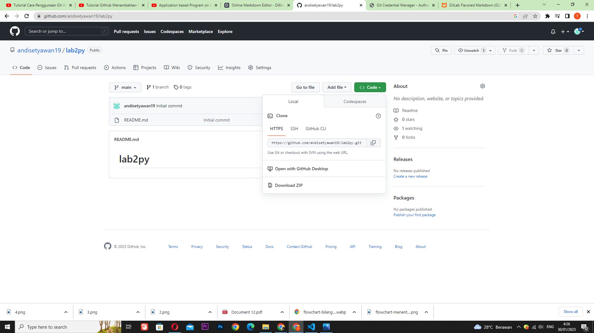
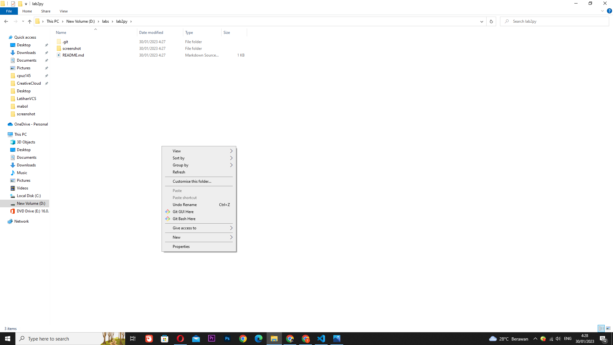
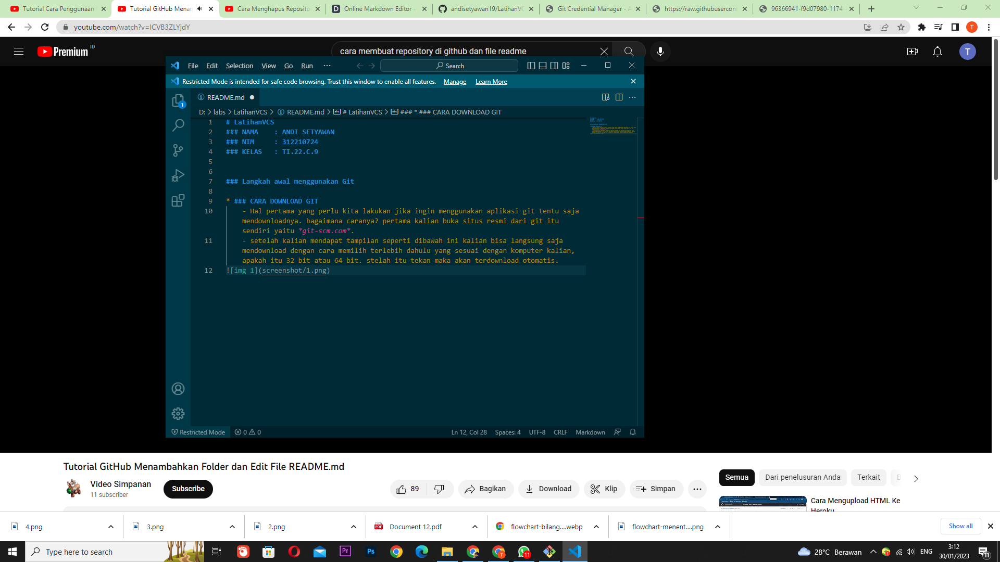
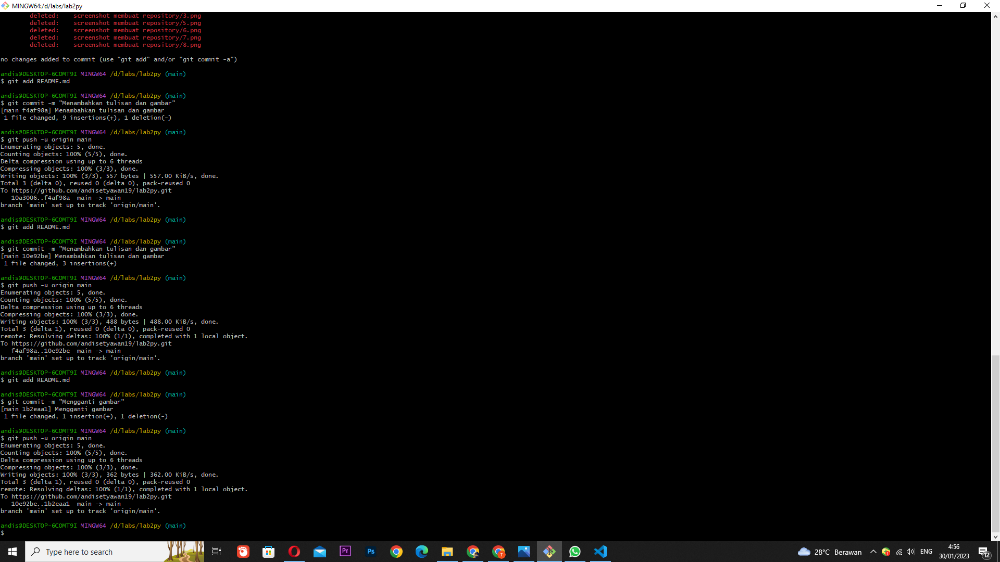

# lab2py

### PENJELASAN PRAKTIKUN LATIHAN VCS MENGGUNAKAN GITHUB

## Sebelumnya kita sudah belajar tentang cara membaut akun dan repository di github
# kali ini kita akan memberi tahu baggai mana mengedit file readme.md

- pertama copy link repository kalian

- kemudian buka folder penyimpanan repository kalian, lalu klik kanan dan pilih git bush pada folder yang dituju.

- setelah itu keluar dari bush
- kemudian buka file readme.md yang ada pada folder lab2py, setelah terbuka kalian bisa mengedit apa yang inigin kalian tuliskan, dan kemudian bisa dimasukkan update yang kalian lakukan dengan cara git add, kemudian commit, dan push untuk mengupdate apa yang kita masukkan ke repository.

* gambar mengedit readme.md

* gambar mengedit di git-scm

